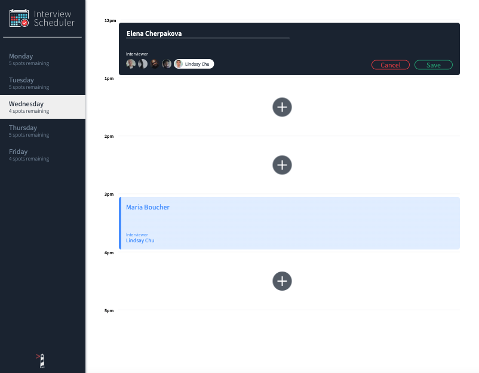
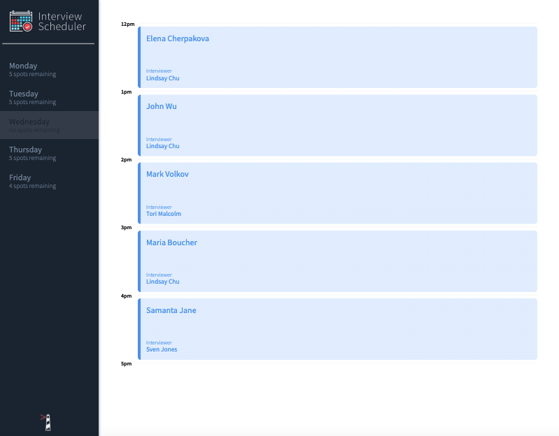

# Interview Scheduler

Interview Scheduler is a single page application (SPA), built using React.
Data is persisted by the API server using a PostgreSQL database. It uses jest and cypress testing.


*Schedule-interview*



*Save-interview*


*Fully booked day with interivews*



*Delete interivew*


<<<<<<< HEAD


=======
>>>>>>> 02686492551e438d3cea1c2196a9dc1e7c5d2273

## Getting Started

1. Clone the repository onto your local device.
2. Install dependencies using the `npm install` command.
3. Start the web server using the `npm start` command.
   The app will be served at <http://localhost:8080/>
4. Go to <http://localhost:8080/> in your browser.

## Dependencies

- axios
- @testing-library/react-hooks
- react
- react-dom
- react-scripts
- react-test-renderer
- node-sass
- storybook
- babel
- classnames
- eslint-plugin-cypress
- normalize.css

## Running Webpack Development Server

```sh
npm start
```

## Running Jest Test Framework

```sh
npm test
```

## Running Storybook Visual Testbed

```sh
npm run storybook
```
